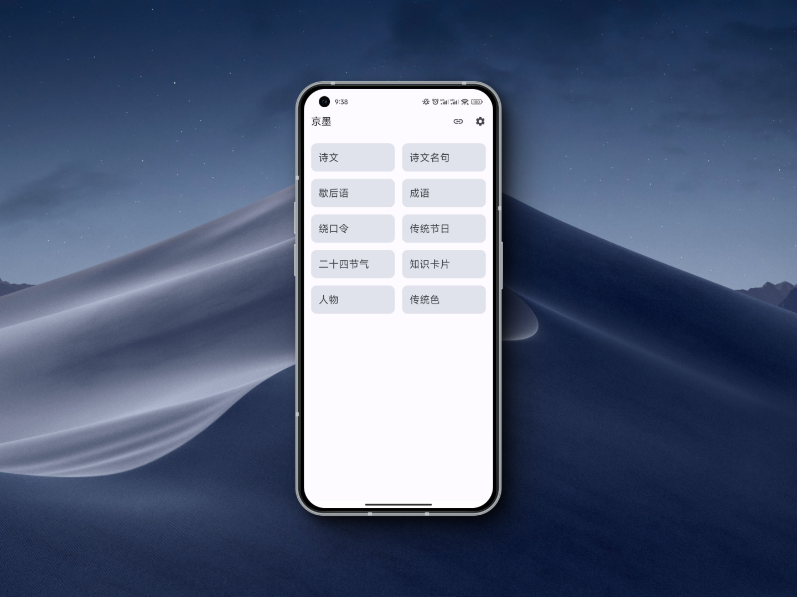

# 京墨



## 仓库

Github:[https://github.com/hefengbao/jingmo](https://github.com/hefengbao/jingmo)

Gitee:[https://gitee.com/hefengbao/jingmo](https://gitee.com/hefengbao/jingmo)

## 介绍

『京墨』开源的古诗词文（名句）、歇后语、成语、传统节日、绕口令等的阅读APP

献给喜欢中华文字、文学、文化的人。

目前的内容有：

1. 诗文 110 万篇,包含诗、词、辞赋、残句、联、文等；
2. 诗文名句 10000 句；
3. 歇后语 14026 条；
4. 成语 49639 条；
5. 中国传统色 161 种；
6. 中国传统节日 19 个；
7. 二十四节气；
8. 绕口令 45 段；
9. 知识卡片 464 组；
10. 字典 20552 字； 
11. 词典 320349 词；

数据来自网络，或有内容错误，欢迎纠错，请在公众号留言。


## 平台支持

Android 8.0 及以上

## 获取更新消息

1. 经常使用 Github 或 Gitee 的同学，可点个 "Star"。

2. 关注微信公众号『NowInLife』或者 B 站『NowInLife』获取最新更新，一般会在公众号发布一篇更新说明，在 B 站发布新功能演示视频。

## 赞助(赠人玫瑰，手有余香。)

微信：


支付宝：


## 运行项目

```shell
git clone https://github.com/hefengbao/jingmo.git
```
在项目根目录下新建 `keystore.properties` 文件， 添加的参数

```
storeFile=
storePassword=
keyAlias=
keyPassword=
```

运行项目即可。

## 参考数据源：

### 古诗词等

[https://cnkgraph.com/](https://cnkgraph.com/) 👍

[https://github.com/a2636340559/PoetryCrawler](https://github.com/a2636340559/PoetryCrawler)

[https://github.com/yht050511/gushiwen](https://github.com/yht050511/gushiwen)

[https://github.com/MinchaoZhu/Chinese-Corpus-Process.git](https://github.com/MinchaoZhu/Chinese-Corpus-Process.git)

[https://github.com/JoshuaCH/chinese_ancient_poetry.git](https://github.com/JoshuaCH/chinese_ancient_poetry.git)

[https://github.com/caoxingyu/chinese-gushiwen.git](https://github.com/caoxingyu/chinese-gushiwen.git)

[https://github.com/chinese-poetry/chinese-poetry.git](https://github.com/chinese-poetry/chinese-poetry.git)

### 中国色

[https://github.com/zerosoul/chinese-colors](https://github.com/zerosoul/chinese-colors)

[http://zhongguose.com/](http://zhongguose.com/)

[https://github.com/imoyao/GUSCSS/](https://github.com/imoyao/GUSCSS/)

### 汉字/成语/词语

[https://hanziwriter.org/cn/](https://hanziwriter.org/cn/)（[文档](https://hanziwriter.org/cn/docs.html)）

[https://github.com/chanind/hanzi-writer-data](https://github.com/chanind/hanzi-writer-data)

[https://github.com/skishore/makemeahanzi](https://github.com/skishore/makemeahanzi)

[https://github.com/mapull/chinese-dictionary](https://github.com/mapull/chinese-dictionary)

[https://github.com/pwxcoo/chinese-xinhua.git](https://github.com/pwxcoo/chinese-xinhua.git)

[汉字部首表](https://baike.baidu.com/item/%E6%B1%89%E5%AD%97%E9%83%A8%E9%A6%96%E8%A1%A8/1993677)

### 其他

[https://github.com/dengxiuqi/ChineseLyrics](https://github.com/dengxiuqi/ChineseLyrics)

~本项目使用的数据位于 `app/src/main/assets` 目录下，有需要的请自取😀~

1.6.0 及之前，本项目使用的数据位于 `app/src/main/assets` 目录下，1.6.1 及以后，放在如下仓库里: `hefengbao/jingmo-data`、`hefengbao/jingmo-data2`, 具体在 `gh-pages` 分支。

## Github Star History

[](https://star-history.com/#hefengbao/jingmo&Date)

## 其他

~初名为『文曲星』，很俗套的名字，又容易让人误会和文曲星字典有什么关系，在网上搜来搜去，第一次知道”京墨“，是一味中药，觉着还不错，暂时就是这个名字了。
2023.09.10~